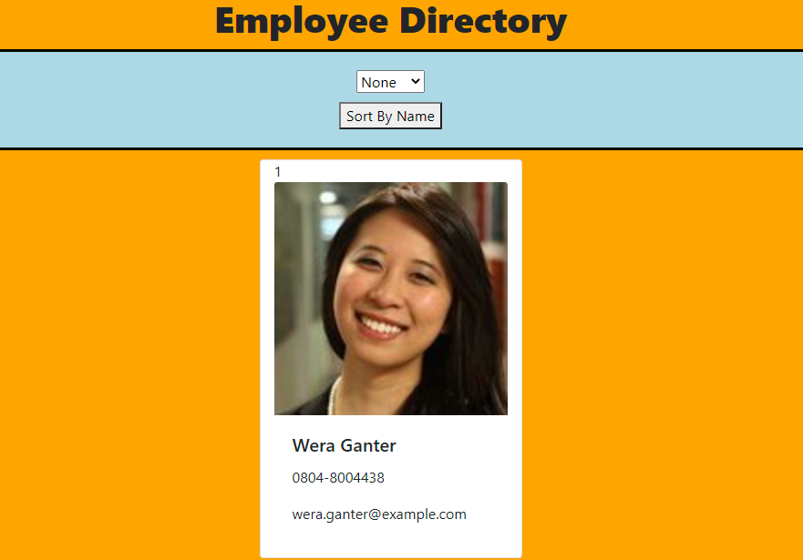

# Employee Durectory 
  
  
 
  

  [Link to webpage](https://guarded-beyond-18776.herokuapp.com/)
  
As a user, I want to be able to view my entire employee directory at once so that I have quick access to their information.
    
  ## Table of Content
  [-Installation](#Installation)  
  [-Description](#Description)    
  [-Usage](#Usage)  
  [-Questions](#Questions)  
  
  
  ## Installation  
  to install locally the user requires to npm install the packages.

  ## Description  
 An employee or manager would benefit greatly from being able to view non-sensitive data about other employees. It would be particularly helpful to be able to filter employees by name.

 Images are all from randomuser.me API

  ## Usage  
  Can sort employees by name or filter employees by gender. There is also easy to find your employee by a nice card with image and information.
  
  ## Questions?  
  
    My Github link is [Nvrtis](https://github.com/Nvrtis)
    Any futher questions can be sent to my email here  <Nvav91@gmail.com>

  
 
  
  

